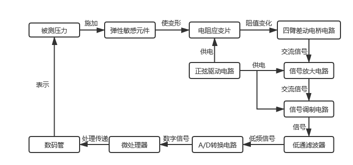
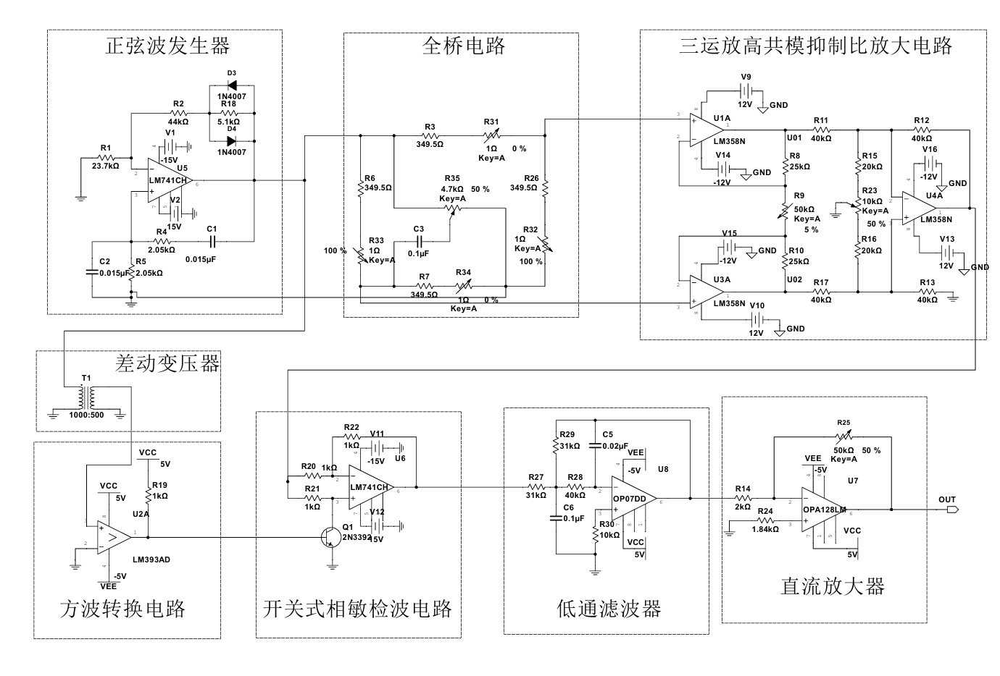

# AC-Excited Sensor Signal Conditioning

交流激励式传感器信号调理电路分析与实现。

这个仓库用于整理本次课程设计中的模拟信号调理主链路，重点不是堆放原始工程文件，而是把设计思路、电路原理、参数计算、仿真结果和实测结果按电路单元组织清楚。

## 文档结构

本项目按三部分展开：

1. 总体设计思路
2. 单元电路设计、仿真与调试
3. 材料清单

## 总体设计思路

系统采用交流激励和同步检波路线。核心思路是：

- 用正弦信号激励桥路
- 将应变引起的电阻变化转换为微弱交流差动信号
- 用高共模抑制比放大电路完成前级放大
- 用同步参考控制相敏检波
- 经过低通滤波和直流放大得到可用输出

整体流程图：

总体电路图：

## 单元电路范围

本仓库当前围绕以下单元展开：

1. 正弦驱动电路
2. 交流全桥及调零电路
3. 三运放高共模抑制比放大电路
4. 方波转换电路
5. 开关式全波相敏检波电路
6. 移相器
7. 低通滤波器
8. 直流放大电路

每个单元按同一结构书写：

`电路设计 -> 参数计算 -> 器件选型 -> 仿真结果 -> 调试与实测结果`

## 关键关系

相敏检波部分的核心关系为：

`v_s(t) = A(x)cos(ωt + φ)`

`v_r(t) = cos(ωt)`

低通后保留与参考同相的平均分量，因此最终输出满足：

`V_out ∝ A(x)cos(φ)`

## 目录入口

总体部分：

- [docs/01_project_overview.md](./docs/01_project_overview.md)
- [docs/02_system_architecture.md](./docs/02_system_architecture.md)
- [reports/final_report.md](./reports/final_report.md)

单元电路部分：

- [docs/modules/01_sine_wave_generator.md](./docs/modules/01_sine_wave_generator.md)
- [docs/modules/02_ac_full_bridge.md](./docs/modules/02_ac_full_bridge.md)
- [docs/modules/03_three_op_amp_amplifier.md](./docs/modules/03_three_op_amp_amplifier.md)
- [docs/modules/04_square_wave_converter.md](./docs/modules/04_square_wave_converter.md)
- [docs/modules/05_phase_sensitive_demodulator.md](./docs/modules/05_phase_sensitive_demodulator.md)
- [docs/modules/06_low_pass_filter.md](./docs/modules/06_low_pass_filter.md)
- [docs/modules/07_dc_amplifier.md](./docs/modules/07_dc_amplifier.md)
