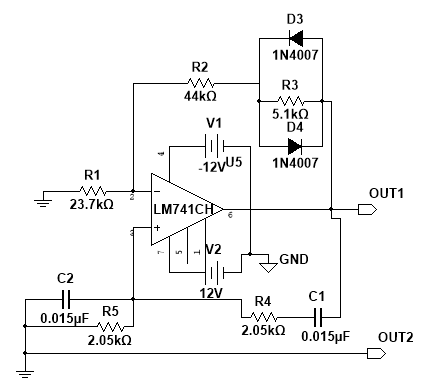
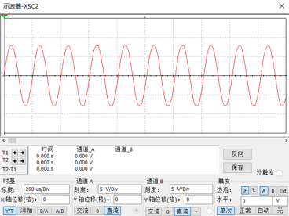
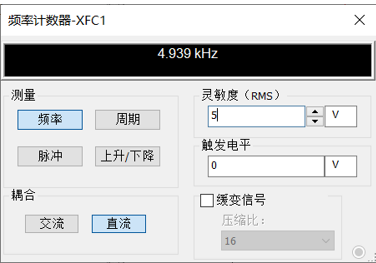
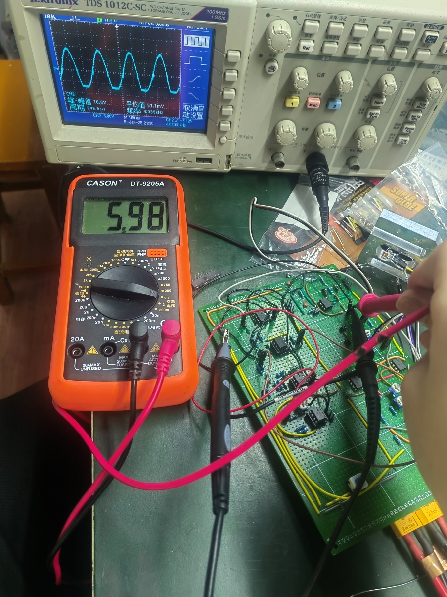

# 01 Sine-Wave Drive Circuit

## 2.1.1 电路设计

正弦驱动电路是整条模拟链路的起点。它一方面给交流全桥提供激励信号，另一方面为后面的方波转换和相敏检波提供频率基准。因此，这一级不仅是信号源，也是参考源。

本设计采用 `RC` 桥式正弦波振荡器，而不采用 `LC` 振荡器。原因是目标频率约为 `5 kHz`，在这一频段下，`RC` 方案结构更简单，器件体积更小，更适合课程设计中的实际制作与调试。

电路图如下：

该电路由四部分组成：

- 运放放大环节
- `RC` 选频网络
- 正反馈网络
- 二极管稳幅网络

其中 `R4`、`R5`、`C1`、`C2` 构成桥式选频网络，决定振荡频率；`D3`、`D4` 与增益支路共同限制环路增益，使输出稳定在近似正弦状态，而不发展为明显削顶波形。

## 2.1.2 参数计算

设计目标为：

- 输出频率约 `5 kHz`
- 输出幅值约 `5.5 V`

桥式振荡器的频率满足：

`f_0 = 1 / (2 pi sqrt(R4 R5 C1 C2))`

当 `R4 = R5 = R`，`C1 = C2 = C` 时，上式化简为：

`f_0 = 1 / (2 pi R C)`

代入设计频率 `f_0 = 5 kHz`，可得：

`RC = 1 / (2 pi f_0) ≈ 3.18 x 10^-5 s`

取 `C = 0.015 uF`，则有：

`R ≈ 3.18 x 10^-5 / (15 x 10^-9) ≈ 2.12 kOhm`

实际电路中取：

- `R4 = R5 = 2.05 kOhm`
- `C1 = C2 = 0.015 uF`

该取值与计算结果一致，属于按标准阻值进行的工程化调整。

放大环节满足：

`A = 1 + (R2 + R3) / R1`

由图中参数：

- `R1 = 23.7 kOhm`
- `R2 = 44 kOhm`
- `R3 = 5.1 kOhm`

代入得：

`A ≈ 1 + (44 + 5.1) / 23.7 ≈ 3.07`

桥式网络反馈系数为：

`beta = 1 / (1 + R4 / R5 + C2 / C1)`

当 `R4 = R5` 且 `C1 = C2` 时：

`beta = 1 / 3`

因此稳态振荡条件满足：

`A beta ≈ 1`

这说明该电路的设计逻辑是正确的：起振时环路增益略大于 1，进入稳态后由二极管稳幅网络将增益压回接近 3，从而保持稳定输出。

## 2.1.3 器件选型

本级核心器件为：

- `LM741CH` 运算放大器
- 二极管稳幅支路

选用该结构的出发点不是追求高速性能，而是满足本设计中 `5 kHz` 正弦激励的产生要求，并且便于后续仿真和实验板搭建。

## 2.1.4 仿真结果

输出波形仿真图：

频率仿真图：

从仿真结果可以看出：

- 输出波形已经形成稳定正弦波
- 振荡频率落在设计目标附近
- 波形失真处于后续桥路激励可接受范围内

对本系统而言，这一级仿真成立的意义在于：后续桥路激励和同步参考都建立在这一频率基础上，一旦该级频率偏差过大，后面整条链路都会失去统一基准。

## 2.1.5 调试与实测结果

实测波形如下：

从实测图可见，电路已经能够输出稳定的正弦信号，说明实际搭建后的起振与稳幅过程基本正常。实测结果与仿真一致地表明：

- 电路能够正常起振
- 输出频率处于目标工作范围
- 输出幅值可满足桥路激励要求

因此，该级已经完成了作为系统激励源和参考源的功能，为后续全桥、方波转换和相敏检波提供了统一的时间基准。
