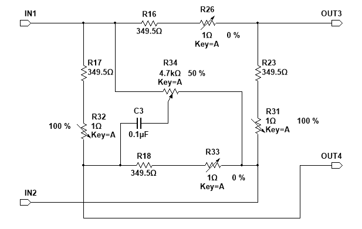
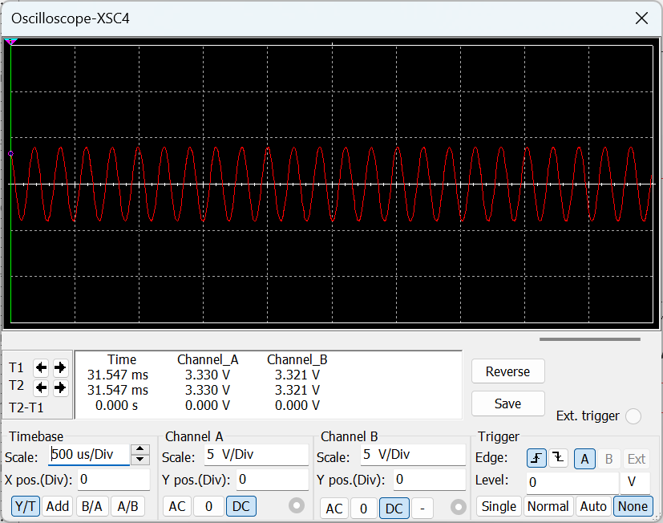
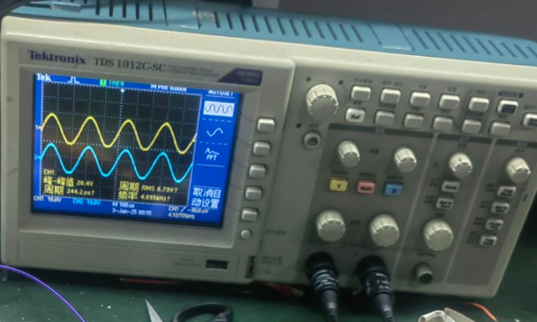

# 02 AC Full Bridge And Zero Adjustment Circuit

## 2.2.1 电路设计

交流全桥及调零电路位于整条测量链路的前端，其作用是把应变片的电阻变化转换成微弱交流差动电压，并尽可能压低桥路零点残余输出，为后级差动放大提供可用输入。

本级采用四臂交流全桥结构。桥路由四片应变片等效构成，在外加交流激励作用下，受力引起的电阻变化被转换为桥路输出电压变化。由于该输出仍然处在载波频率上，所以后面仍可继续保留相位信息并进行同步检波。

电路图如下：

### 工作原理

桥路平衡时，两输出端电位相等，桥路输出接近零；受力后，各桥臂阻值发生微小变化，桥路离开平衡状态，于是在输出端形成微弱交流差动信号。

对于交流桥路，实际问题并不只是电阻失配。应变片引线和分布参数会等效引入附加电容，使桥臂阻抗出现相角差。因此，桥路调零不仅要做电阻平衡，还要做电容补偿，否则无载时也可能存在明显零点残余电压。

### 主要器件作用

- 四个桥臂电阻：构成全桥主体，将电阻变化转换为桥路输出变化
- 可调电阻支路：用于调节桥路静态平衡点
- `R_p-C` 补偿支路：用于修正桥臂阻抗相角差，降低交流桥路零点残余
- `IN1`、`IN2`：桥路激励输入端
- `OUT3`、`OUT4`：桥路差动输出端

从功能上看，桥体负责“把应变变成电压”，调零支路负责“把无载输出压低”，补偿支路负责“把交流桥路调到真正可用状态”。

## 2.2.2 调零方法

本级调零分两步进行：

1. 先调节电阻平衡支路，使桥路在无载时尽量接近平衡
2. 再调节 `R_p-C` 支路，对交流条件下的相角不平衡进行补偿

设计目标不是让桥路理论上绝对平衡，而是让后级放大前的零点残余电压足够小。根据原说明书，调零后的目标是使零点残余电压小于 `1 mV`。

## 2.2.3 输出特性分析

已知桥臂标称阻值为：

`R = 350 Ω`

原说明书给出的应变关系为：

`ΔR / R = Kε`

在设计工况下，报告给出的电阻变化量为：

`ΔR = 0.44 Ω`

因此电阻相对变化量为：

`ΔR / R = 0.44 / 350 ≈ 1.26 × 10^-3`

这说明桥路输出只对应 `10^-3` 量级的相对失衡，因此输出电压必然是微弱信号。对交流全桥而言，可将输出理解为：

`v_b(t) ∝ V_exc · (ΔR / R) · cos(ωt)`

其中：

- `V_exc` 为桥路激励电压
- `ΔR / R` 表示桥路失衡程度
- `ω` 为激励角频率

由此可以看出，本级的核心不是获得大信号，而是稳定、可调零地获得一个弱交流差动输出。

### 仿真建模方式

由于 Multisim 中无法直接模拟机械受力过程，原说明书采用电阻近似法模拟桥路受力：

- 四个桥臂用接近 `350 Ω` 的电阻表示
- 通过 `1 Ω` 级微调电阻引入失衡
- 利用补偿支路模拟交流桥路调零过程

这种处理虽然没有机械模型，但保留了桥路输出所需的电学本质。

## 2.2.4 仿真结果

从仿真结果可以看出，桥路输出仍为载波频率下的小幅交流信号，说明桥路已完成“电阻变化 -> 交流差动电压”的转换。

这一结果验证了两点：

- 桥路失衡后能够输出可检测的交流差动信号
- 调零与补偿后，零点残余没有淹没有效信号

## 2.2.5 调试与实测结果

实测结果表明，实际桥路输出同样表现为交流波形，但相比仿真会出现更多不对称和幅值偏差。这是实际布线、电容分布、接触电阻和测试探头共同作用的正常结果。

对本级而言，实测关注点不是波形是否“绝对理想”，而是：

- 桥路能否稳定调零
- 无载时残余输出是否足够小
- 受力后是否能得到可继续放大的差动交流信号

从当前结果看，本级已经满足后级三运放放大的输入要求。
