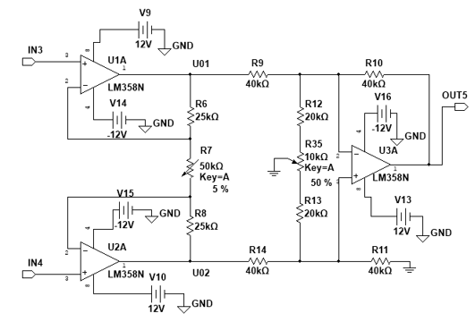
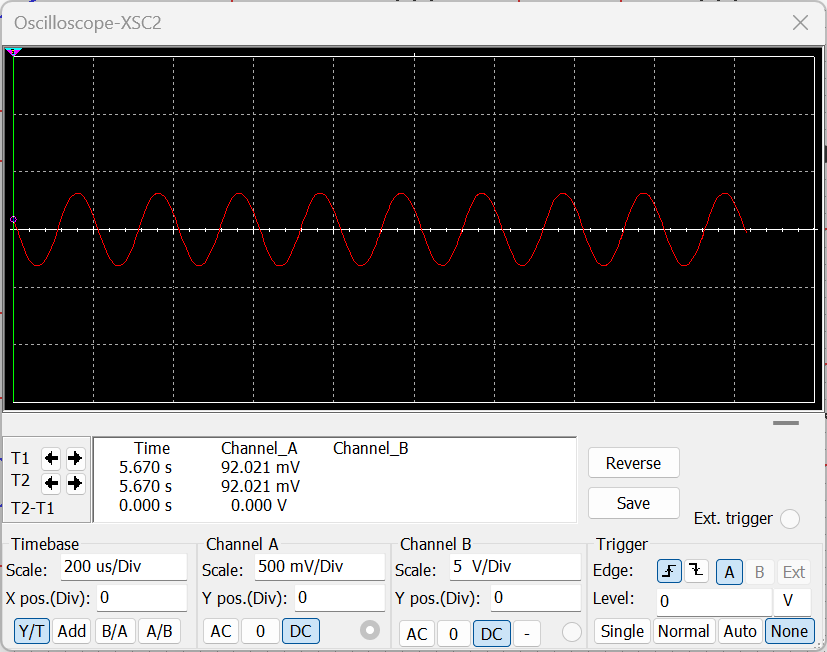
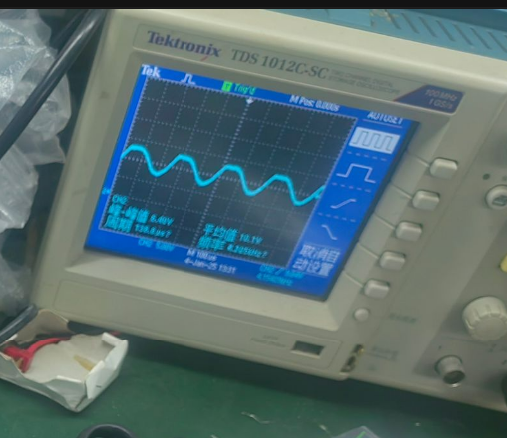
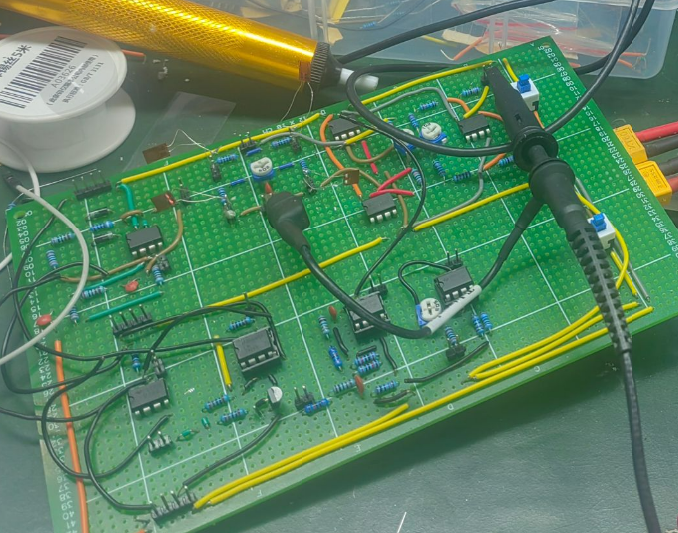

# 2.3 三运放高共模抑制比放大电路

## 2.3.1 电路设计

三运放高共模抑制比放大电路位于交流全桥之后，是整条模拟链路的第一级有源放大电路。它的任务不是单纯把信号放大，而是在长线传输和弱差动输入条件下，尽量只放大有效差模分量，同时压制共模干扰。

本级采用三运放仪用放大器结构，而不是普通单端放大或简单差动放大。原因很明确：桥路输出只有毫伏级，而实际布线和外部环境会引入明显共模干扰。如果前级不能先把差模分量干净地提起来，后续相敏检波的输入质量就无法保证。

电路图如下：

### 工作原理

该电路可分为两级理解。

第一部分由 `U1A`、`U2A` 构成双输入前级。两路输入信号分别进入高输入阻抗运放，通过共享电阻 `R7` 建立差模增益。这一级的作用是先把桥路输出中的差模分量提起来，同时尽量不破坏输入平衡。

第二部分由 `U3A` 与 `R9`、`R10`、`R11`、`R14` 构成差动减法器。它利用对称电阻比实现两路信号相减，从而保留差模分量并抑制共模分量。

电路中还引入了 `R12`、`R13` 和可调电阻 `R15` 组成的共模补偿支路。其作用不是提高主增益，而是在实际元件不完全对称时补偿共模泄漏，以提高实际共模抑制比。

### 主要器件作用

- `U1A`、`U2A`：输入级差模预放大
- `R6`、`R7`、`R8`：决定前级差模增益
- `U3A`：输出级差动放大与共模抑制核心
- `R9`、`R10`、`R11`、`R14`：构成对称减法网络，决定后级差模增益
- `R12`、`R13`、`R15`：构成共模补偿支路，用于提高实际共模抑制比

从作用上看，前级负责“把弱差模信号提起来”，后级负责“把共模量压下去”。

## 2.3.2 参数计算

### 放大倍数设计目标

原说明书给出的系统幅值目标为：

`40 mV -> 4 V`

因此整条链路总放大倍数约为：

`G_total ≈ 100`

本级不承担全部增益，而是负责完成第一级稳定差模放大。报告给出的设计结论是本级闭环增益取：

`K ≈ 10`

这样可以先把毫伏级桥路输出提升到后级同步检波更容易处理的量级，同时保留后续低通和直流放大的调整余量。

### 前级差模增益

对三运放输入级，有：

`A_d1 = 1 + 2R / R_g`

其中：

- `R = R6 = R8 = 25 kΩ`
- `R_g` 为 `R7` 的等效阻值

因此：

`A_d1 = 1 + 50 kΩ / R_g`

若设计目标取前级差模增益约 `10`，则有：

`10 = 1 + 50 kΩ / R_g`

解得：

`R_g ≈ 5.56 kΩ`

这也是采用 `50 kΩ` 可调电阻的原因：不是为了任意调大增益，而是为了把工作点调到目标差模增益附近。

### 后级差模增益

输出级采用对称电阻比：

`R9 = R10 = R11 = R14 = 40 kΩ`

因此输出级差模增益为：

`A_d2 = R10 / R9 = R11 / R14 = 1`

所以本级总差模增益近似为：

`A_d = A_d1 · A_d2 ≈ 10 × 1 = 10`

这与原说明书给出的 `K = 10` 一致。

### 共模增益与共模抑制比

共模抑制能力不能只靠“用了三运放结构”来保证，必须写成参数关系。

共模抑制比定义为：

`CMRR = 20 lg(A_d / A_cm)`

其中：

- `A_d` 为差模增益
- `A_cm` 为共模增益

对理想对称输出级，当电阻比严格满足：

`R10 / R9 = R11 / R14`

时，共模输入在减法器中被完全抵消，因此理论上：

`A_cm = 0`

此时 `CMRR` 理论上趋于无穷大。

但在实际电路中，电阻误差、连线不对称和器件偏差都会使 `A_cm` 不再为零，因此只能通过两种手段提高实际 `CMRR`：

- 尽量保证减法网络电阻比对称
- 调节 `R15` 补偿共模泄漏

所以 `R15` 的工程意义不是改变主增益，而是尽可能减小 `A_cm`，从而增大 `CMRR`。

## 2.3.3 器件选型

本级核心器件为：

- `LM358`
- 对称电阻网络
- 共模补偿可调电阻 `R15`

选用 `LM358` 的原因是该器件易于实现双运放输入级，供电和实际搭建都较方便，能够满足本设计中前级弱信号差模放大的要求。

## 2.3.4 仿真结果

从仿真结果可以看出，输出仍保持载波频率下的正弦波形，说明本级工作在线性区，没有出现明显削顶和失真。

这一结果验证了三点：

- 差模信号已经被有效放大
- 本级带宽能够覆盖 `5 kHz` 工作频率
- 放大后的信号适合送入后级方波参考和相敏检波链路

## 2.3.5 调试与实测结果

实测结果表明，本级在实际电路板上仍能够输出放大后的交流波形，说明差模放大功能已经建立。相比仿真，实际波形会受到布线、器件离散性和外部耦合的影响，因此更能体现共模补偿支路存在的必要性。

对本级而言，调试重点不是只看“有没有输出”，而是看以下两点：

- 放大倍数是否落在设计范围内
- 共模干扰是否被压到后级可接受水平

从当前结果看，本级已经完成了前级差模放大任务，并为后续同步检波提供了可用输入。

