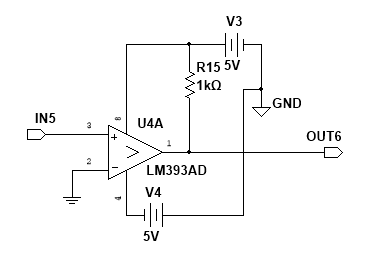
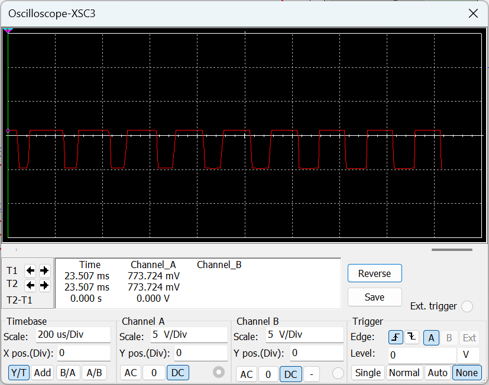
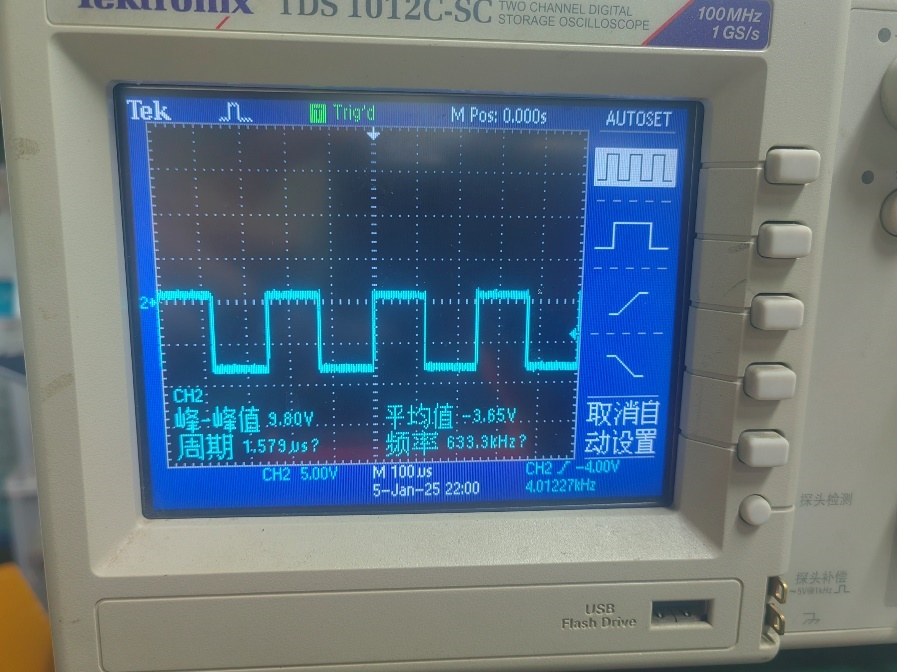

# 2.4 方波转换电路

## 2.4.1 电路设计

方波转换电路属于参考路径，其作用是把正弦激励信号转换为同频方波参考，以便后级开关式相敏检波电路进行同步控制。

这一单元不负责放大测量信号，也不承担幅值信息传递。它的核心任务只有一个：准确给出过零时刻和极性翻转时刻。

电路图如下：

### 工作原理

本级采用 `LM393` 组成过零比较器。输入正弦信号接入同相端，反相端接地，因此比较阈值为：

`v_th = 0`

设输入信号为：

`v_i(t) = V_m cos(ωt)`

则当 `v_i(t)` 经过零点时，比较器输出发生翻转，于是输出得到与输入同频的方波参考：

`v_r(t) = V_H ,  v_i(t) ≥ 0`

`v_r(t) = V_L ,  v_i(t) < 0`

因此其频率满足：

`f_r = f_i`

这正是同步检波所要求的参考条件。

### 主要器件作用

- `LM393`：完成过零比较，将正弦波变为方波
- `R15 = 1 kΩ`：作为上拉电阻，建立输出高电平
- `IN5`：正弦参考输入端
- `OUT6`：方波参考输出端

从作用上看，本级并不恢复输入的模拟幅值，只负责把“正负半周信息”变成可用于电子开关控制的方波极性信息。

## 2.4.2 器件选型

本级核心器件为 `LM393`。选用该器件的原因是：

- 适合做过零比较
- 输出端结构便于形成方波参考
- 实际搭建简单，能够满足本系统 `5 kHz` 参考转换要求

## 2.4.3 仿真结果

从仿真结果可以看出，输出已经形成稳定方波，并且频率与输入参考保持一致。这说明：

- 比较器能够正常完成过零翻转
- 输出频率与激励频率一致
- 后级相敏检波已经具备同步控制信号

对于本系统而言，本级仿真成立的关键不是“波形好看”，而是“参考时序正确”。

## 2.4.4 调试与实测结果

实测结果表明，本级能够稳定输出方波信号。相对于仿真，实际波形会表现出更明显的边沿噪声和幅值波动，但只要翻转时刻稳定、频率正确，就能够满足后级同步检波要求。

因此，本级调试关注点主要是：

- 是否能够稳定输出方波
- 输出频率是否与正弦激励一致
- 方波幅值是否足以驱动相敏检波中的开关器件

