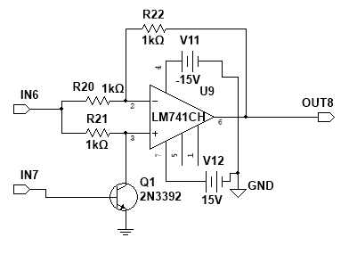
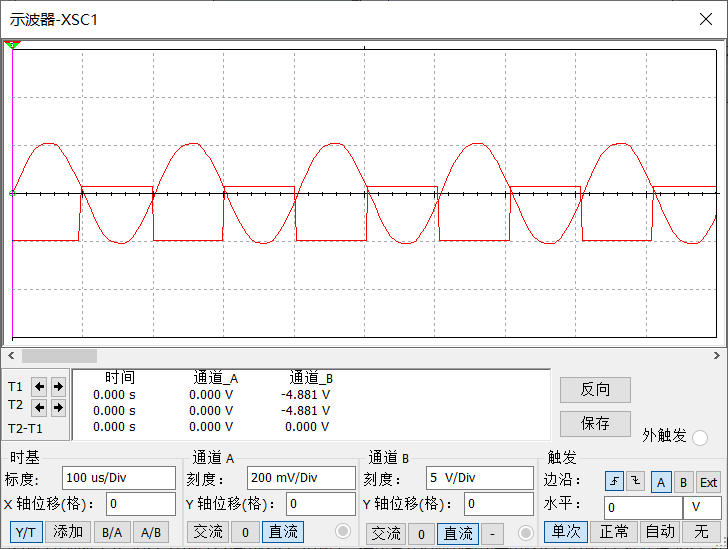
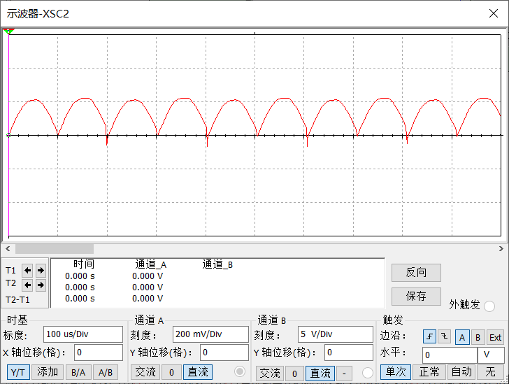
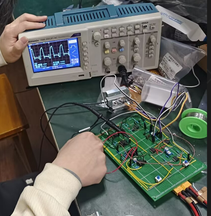

# 05 Phase-Sensitive Demodulator

## Role In The Full Chain

This module is the core of the whole signal-conditioning system. It converts the amplified AC sensor signal into a signed average-valued waveform that can later be filtered into DC.

## Schematic

Extracted from the report:

## Working Principle

The current implementation uses a switch-mode full-wave phase-sensitive detector rather than a simple envelope detector. The square-wave reference controls a switching action so that the amplified sensor signal is either passed directly or polarity-inverted depending on the reference state.

This produces a waveform whose average value depends on the phase relationship between the signal and the reference.

That is why this module can preserve direction information:

- in phase -> positive average
- anti-phase -> negative average
- quadrature -> average near zero

## Design Parameters And Calculation

### Core Mathematical Relation

If the input signal is written as:

`v_s(t) = A(x)cos(omega t + phi)`

and the synchronous reference is:

`v_r(t) = cos(omega t)`

then after ideal multiplication and low-pass extraction:

`V_out ∝ A(x)cos(phi)`

This is the central theoretical basis of the module.

### Engineering Meaning

This stage does not merely detect amplitude. It extracts the component of the signal that is phase-aligned with the reference.

## Key Devices

The report mentions this stage with:

- `LM741CH`
- `2N3392`

## Design Notes

This module is highly sensitive to:

- reference phase accuracy
- switching feedthrough
- residual offset from the previous stage

Any imperfection here directly affects the final DC polarity and scale.

## Simulation Result

Extracted simulation figures:

Expected simulation conclusion:

- detector output average changes sign with phase reversal
- waveform shape matches the expected switch-mode full-wave behavior

## Practical Result

Extracted practical waveform:

Still to be supplemented later:

- switching ripple note
- effect of changing the reference phase if tested

## Comparison And Conclusion

The final comparison should answer:

- Does the stage preserve sign information correctly?
- Is the output polarity consistent with theory?
- Are switching artifacts small enough for the low-pass stage to handle?

## To Add Next

- exact switching network values
- pre-LPF waveform screenshot
- practical waveform screenshot
