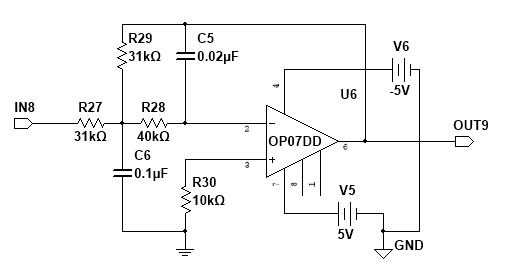
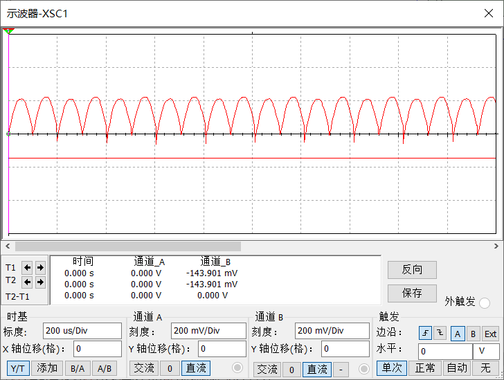
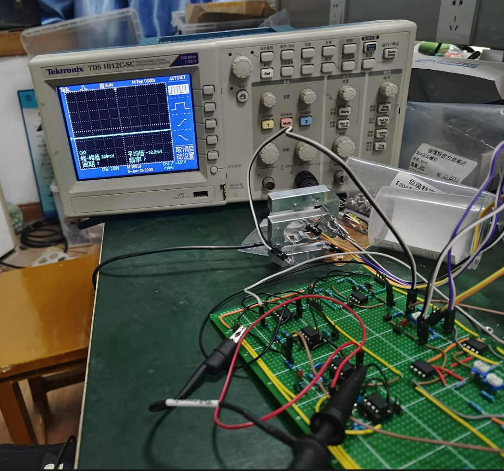
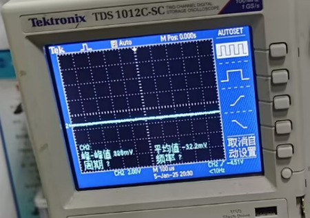

# 06 Low-Pass Filter

## Role In The Full Chain

This module removes the carrier-related ripple from the phase-sensitive detector output and retains the useful DC or slowly varying component.

## Schematic

Extracted from the report:

## Working Principle

After synchronous detection, the waveform contains two parts:

- the useful low-frequency or DC average term
- higher-frequency residue related to the carrier and switching process

The low-pass filter suppresses the high-frequency component and keeps the average term so that the signal becomes suitable for final DC amplification.

## Design Parameters And Calculation

### Known Design Target

- low-pass cutoff frequency: `100 Hz`

### Why This Value Is Chosen

The carrier frequency is `5 kHz`, so the low-pass cutoff is intentionally placed far below the carrier-related residue. This ensures strong attenuation of unwanted high-frequency terms while preserving slow changes in the measured quantity.

### Known Topology

The report specifies a second-order MFB active low-pass filter.

This choice provides:

- stronger attenuation than a single RC stage
- better control over cutoff behavior
- less signal loss than a passive-only solution

## Key Devices

The report documents:

- `OP07D`

## Design Notes

This stage determines the tradeoff between:

- ripple suppression
- output response speed

If the cutoff is too high, ripple remains visible. If it is too low, the output becomes sluggish.

## Simulation Result

Extracted simulation waveform:

Expected simulation conclusion:

- carrier-related residue is strongly reduced
- output is smoother and closer to the desired DC level

## Practical Result

Extracted practical figures:

Still to be supplemented later:

- observed residual ripple value
- settling behavior note

Known reference from the report:

- one representative low-pass output level is about `-144 mV`

## Comparison And Conclusion

The final comparison should answer:

- Is the cutoff suitable for the real system?
- Is ripple suppressed enough for the DC amplifier and display?
- Is the response speed still acceptable?

## To Add Next

- exact resistor and capacitor values
- waveform screenshots before and after filtering
- measured ripple amplitude
