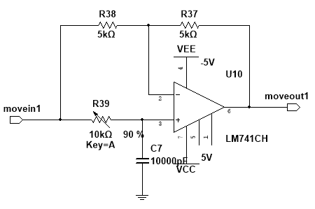
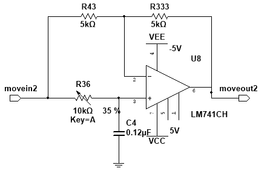
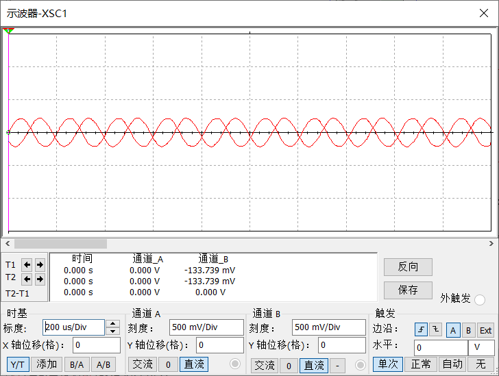

# 2.6 移相器

## 2.6.1 电路设计

移相器位于参考路径中，作用是补偿实际电路中由桥路、放大器、连线和器件非理想性带来的相位偏差，使参考方波与被检波交流信号保持正确相位关系。

仿真中各级通常默认同相，但实际系统不可能保证整个链路严格无相移。如果参考相位与被测交流信号偏离过大，相敏检波后的平均值会减小，严重时甚至会出现极性判断错误，因此需要在参考路径中加入可调移相单元。

本设计采用一阶有源移相网络，分别给出 `0°~180°` 超前和 `0°~180°` 滞后两种形式。

0°~180° 超前移相电路：

0°~180° 滞后移相电路：

### 工作原理

该电路本质上属于一阶全通移相网络。运放与对称电阻构成近似单位增益通道，`R-C` 支路只改变相位，不以放大幅值为目的。

当调节可变电阻时，`R-C` 网络的时间常数发生变化，输出相位相对于输入相位随之连续变化。采用超前结构或滞后结构，可以根据实际链路误差方向选择参考信号提前或滞后。

### 主要器件作用

- `U10`、`U8`：构成有源移相网络，保证输出幅值基本稳定
- `R37`、`R38`、`R43`、`R333`：构成对称反馈与输入电阻网络
- `R39`、`R36`：可调电阻，用于连续调节相移量
- `C7`、`C4`：与可调电阻共同决定相移范围

从功能上看，本级负责“调相”，而不是“调幅”。

## 2.6.2 参数计算

对一阶全通移相网络，可写出其幅相关系近似为：

`|H(jω)| ≈ 1`

相移量由 `ω`、`R` 和 `C` 共同决定，其设计关系可写成：

`φ = ±2 arctan(ωRC)`

其中正负号对应超前或滞后两种实现形式。若已知目标相移 `|φ|`，则可以反算：

`RC = tan(|φ| / 2) / ω`

系统工作频率约为：

`f = 5 kHz`

因此：

`ω = 2πf ≈ 3.14 × 10^4 rad/s`

若希望在该频率点补偿约 `45°` 相移，则有：

`RC = tan(22.5°) / ω ≈ 1.32 × 10^-5 s`

例如取：

`C = 0.01 μF`

则对应电阻约为：

`R ≈ 1.32 kΩ`

这说明在 `5 kHz` 工作点附近，只要采用 `kΩ` 量级可调电阻配合 `nF` 到 `0.1 μF` 量级电容，就可以覆盖实际调相所需范围。图中的 `10 kΩ` 可调电阻正是为这一目的设置，用于在联调阶段精确修正参考相位。

## 2.6.3 仿真结果

移相前后对比波形如下：

仿真结果表明，经过移相器后，输出与输入仍保持相同频率，但相位已经发生可控偏移。这说明：

- 移相网络没有破坏参考频率
- 输出幅值没有出现明显异常衰减
- 调节可变电阻可以改变相位位置，为相敏检波提供相位校正手段

## 2.6.4 调试与实测结果

当前资料中尚未补入移相器独立实测波形图，因此本级联调时主要关注以下两点：

- 调节移相器后，相敏检波直流输出是否达到最大幅值
- 同相、反相和正交三种状态下，输出极性和幅值是否符合理论关系

实际调试时，可以把相敏检波后低通输出的直流量作为调相依据：当 `|V_out|` 最大且极性正确时，可认为参考相位已调到合适位置。

