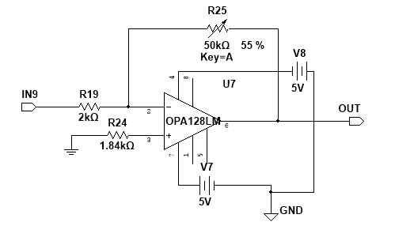
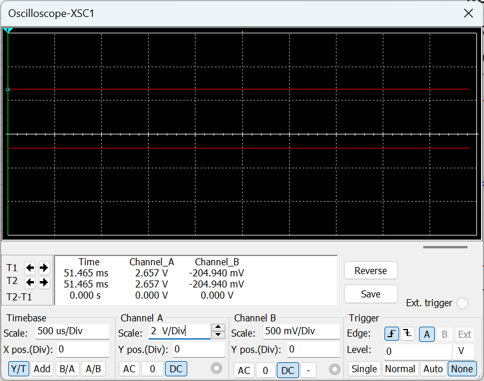

# 2.8 直流放大电路

## 2.8.1 电路设计

直流放大电路位于低通滤波器之后，其作用是把已经提取出的低电平直流量进一步放大到最终可用范围。

到这一级为止，交流载波信息已经处理完毕，因此本级不再负责检波或滤波，而只负责最后的量程匹配和输出缩放。

电路图如下：

### 工作原理

本级采用运放闭环直流放大结构。输入端接收低通滤波输出的低电平直流信号，反馈电阻与输入电阻共同决定闭环增益，从而把毫伏级直流量提升到伏级输出。

本级的关键不是频率响应，而是：

- 放大倍数是否正确
- 输出极性是否符合设计要求
- 前级残余纹波在本级放大后是否仍可接受

### 主要器件作用

- `U7`：直流放大核心
- `R19`：输入电阻，决定输入比例
- `R25`：反馈可调电阻，用于设定闭环增益
- `R24`：建立同相端基准
- `IN9`：低通输出输入端
- `OUT`：最终模拟输出端

从功能上看，本级负责“把已经提取出的有用直流量放大到目标输出范围”。

## 2.8.2 参数计算

原说明书给出的低通输出代表值约为：

`V_LPF ≈ -144 mV`

最终目标输出约为：

`V_out ≈ 2 V`

因此所需直流放大倍数为：

`G_DC = |V_out / V_LPF| = |2 / 0.144| ≈ 13.9`

这就是本级最关键的参数。它说明本级的核心任务非常明确：把前级已经提取出的 `-144 mV` 量级直流量放大到约 `2 V` 输出范围。

## 2.8.3 仿真结果

从仿真结果可以看出，输入约 `-204.94 mV` 时，输出已经达到约 `2.657 V`，说明本级直流放大功能已经建立，并且输出被提升到了伏级范围。

按该组仿真点计算，等效增益约为：

`G ≈ |2.657 / 0.20494| ≈ 12.97`

这说明仿真工作点下的实际增益与设计目标 `13.9` 同量级，后续仍可通过反馈电阻调节进一步逼近目标值。

## 2.8.4 调试与实测结果

目前还未补入该级独立实测波形图，因此后续调试应重点关注：

- 增益是否达到设计值附近
- 输出零点是否稳定
- 低通级残余纹波在放大后是否仍可接受
- 输出是否满足最终显示或后续接口的量程要求

从现有仿真结果看，本级已经完成了“毫伏级直流量 -> 伏级输出”的最终缩放任务。

