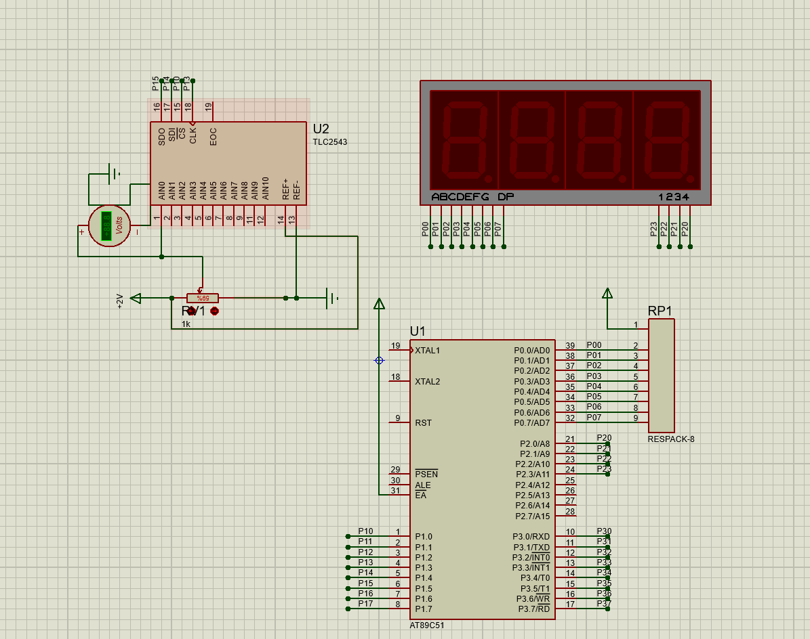

# 补充：三位半数显表头

三位半数显表头不属于模拟调理主链路，但它负责把前级已经得到的 `0~2 V` 电压量转换为直观显示值，因此可以作为后端显示与验证部分的补充单元。

## 电路组成

该部分由以下单元构成：

- `TLC2543`：12 位 `A/D` 转换器，负责把输入模拟电压转换为数字量
- `AT89C51`：读取 `A/D` 数据并完成显示扫描控制
- 四位数码管：动态显示采样结果
- `RV1`：滑动变阻器，用于仿真中模拟 `0~2 V` 输入变化
- `RP1`：排阻，用于数码管段线限流与接口连接

从作用上看，这一级不再参与放大、检波或滤波，而是把已经调理完成的模拟输出转换为可观察的数字显示结果。

## 参数与量化关系

原说明书要求显示分辨率达到 `0.001 V`，即 `1 mV`。

本设计选用 `TLC2543`，其量化位数为 `12 bit`，满量程取 `0~2 V`。因此单个量化步距为：

`ΔV = 2 / 4095 V ≈ 0.488 mV`

这个量化步距小于 `1 mV`，因此满足显示分辨率要求。

根据程序中的换算关系，有：

`V_in = N / 4095 × 2 V`

其中 `N` 为 `A/D` 转换结果。程序随后按：

`D = 1000 V_in`

把输入电压换算为毫伏量级，并通过四位数码管动态显示。因此该显示级的核心设计关系不是放大倍数，而是 `A/D` 分辨率与显示量程是否匹配。

## 仿真结果

仿真图表明，`TLC2543`、单片机和数码管已经构成完整显示链路。通过调节 `RV1`，输入电压变化后能够经 `A/D` 转换并送到数码管显示。

这一结果主要说明三点：

- 输入电压量程与 `A/D` 参考范围匹配
- 单片机能够正确读取 `TLC2543` 数据
- 数码管动态扫描显示已经建立

## 说明

这一页作为显示部分补充记录保留。主报告正文仍以模拟信号调理主链路为主，即：

`正弦驱动 -> 交流全桥 -> 放大 -> 相敏检波 -> 低通 -> 直流放大`
